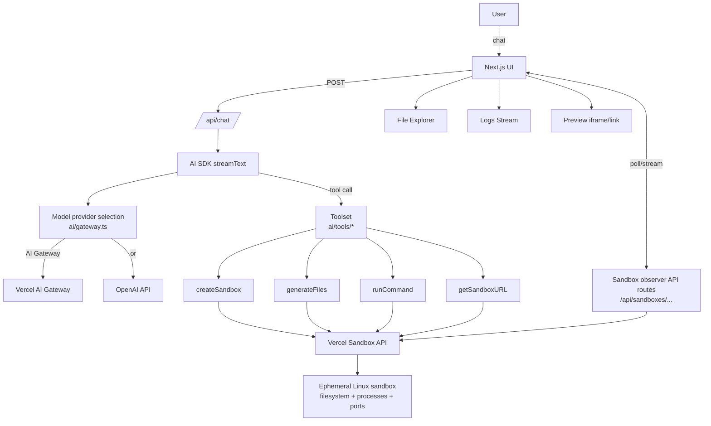
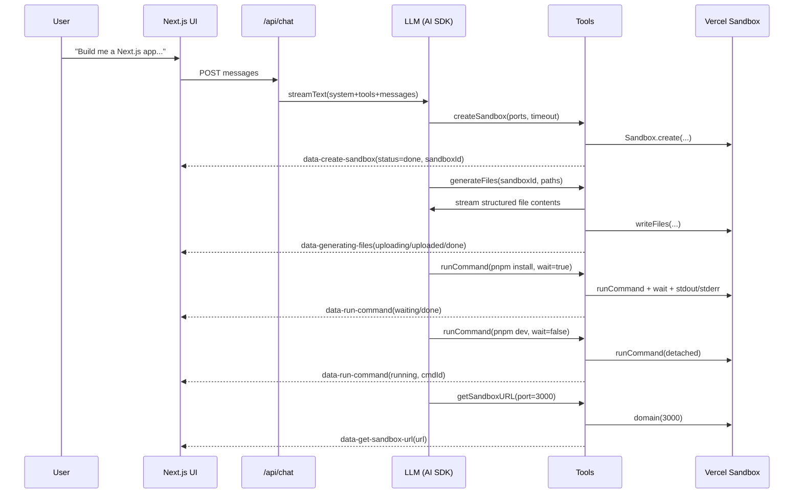

# Vibe Coding Platform (Vercel Sandbox + AI Gateway) — Complete Walkthrough

This explanation is based on these core files:
- `apps/vibe-coding-platform/ai/gateway.ts:1`
- `apps/vibe-coding-platform/ai/constants.ts:1`
- `apps/vibe-coding-platform/ai/tools/index.ts:1`
- `apps/vibe-coding-platform/ai/tools/create-sandbox.ts:1`
- `apps/vibe-coding-platform/ai/tools/generate-files.ts:1`
- `apps/vibe-coding-platform/ai/tools/run-command.ts:1`
- `apps/vibe-coding-platform/ai/tools/get-sandbox-url.ts:1`
- `apps/vibe-coding-platform/app/api/chat/route.ts:1`
- `apps/vibe-coding-platform/app/api/models/route.tsx:1`
- `apps/vibe-coding-platform/app/api/sandboxes/[sandboxId]/route.tsx:1`
- `apps/vibe-coding-platform/app/api/sandboxes/[sandboxId]/files/route.ts:1`
- `apps/vibe-coding-platform/app/api/sandboxes/[sandboxId]/cmds/[cmdId]/logs/route.ts:1`
- `apps/vibe-coding-platform/app/state.ts:1`
- `apps/vibe-coding-platform/components/commands-logs/commands-logs-stream.tsx:1`
- `apps/vibe-coding-platform/components/file-explorer/file-content.tsx:1`

---

## 1) What is Vercel?

**Vercel** is a cloud platform primarily used to **build and deploy web apps** (especially Next.js). It provides:
- Hosting (CDN, serverless/edge functions, caching)
- Developer workflow (preview deployments, CI integration)
- “AI Cloud” products used here:
  - **Vercel AI Gateway**: a unified endpoint to access multiple LLM providers/models behind one API surface.
  - **Vercel Sandbox**: an ephemeral, isolated compute environment for running untrusted code safely.

In this repo, the “Vibe Coding Platform” demo app is designed to run on Vercel, but it also runs locally.

---

## 2) What is the code intending to do?

This app is a **chat-driven coding agent**:
- The user chats with an assistant.
- The assistant can **create an isolated sandbox**, **generate project files**, **run commands** (install/build/dev server), and **return a preview URL**.
- The UI shows:
  - tool progress (sandbox created, files uploaded, commands running)
  - command logs streaming in real time
  - a remote file explorer reading files out of the sandbox

Key idea: the LLM isn’t only “texting” — it can call tools that actually execute a build/run workflow inside a sandbox.

---

## 3) How does the code achieve its target?

### A. Model selection + provider routing (`ai/gateway.ts`)
`apps/vibe-coding-platform/ai/gateway.ts:1` does two jobs:

1) **List available models** (`getAvailableModels()`):
- If “gateway mode” is enabled, it calls `createGateway().getAvailableModels()`.
- If that fails, or gateway mode is off, it falls back:
  - If `OPENAI_API_KEY` exists, it returns only GPT-5 (`Models.OpenAIGPT52`).
  - Otherwise returns `[]`.

2) **Return “model options” for AI SDK** (`getModelOptions(modelId, options)`):
- It chooses between:
  - **Vercel AI Gateway** (via `@ai-sdk/gateway`), or
  - **Direct OpenAI** (via `@ai-sdk/openai`)
- It also attaches provider-specific options:
  - For GPT-5: includes reasoning-related fields and `reasoningEffort`
  - For some Anthropic models: enforces “must use gateway”, adds an `anthropic-beta` header and providerOptions

**Important switch:**
```ts
function shouldUseGateway() {
  return Boolean(process.env.AI_GATEWAY_API_KEY || process.env.VERCEL)
}
```
So on Vercel deployments (`VERCEL` env var is set), the code prefers the Gateway path.

### B. Chat endpoint streams an agent with tools (`app/api/chat/route.ts`)
`apps/vibe-coding-platform/app/api/chat/route.ts:1` is the main “agent runtime”:

- It receives chat messages from the UI.
- It picks a model from `getAvailableModels()`.
- It starts streaming a response using AI SDK `streamText(...)`.
- It injects:
  - a **system prompt** (`apps/vibe-coding-platform/app/api/chat/prompt.md:1`)
  - a **toolset** (`tools({ modelId, writer })`)

The key line is:
```ts
tools: tools({ modelId, writer })
```

That means the LLM can call:
- `createSandbox`
- `generateFiles`
- `runCommand`
- `getSandboxURL`

…and each tool can stream UI “data parts” back to the frontend during execution.

### C. Tools = “capabilities” connected to Vercel Sandbox (`ai/tools/*`)
All tools are defined with `tool({ description, inputSchema, execute })` from `ai`.

#### 1) Create sandbox (`ai/tools/create-sandbox.ts`)
`apps/vibe-coding-platform/ai/tools/create-sandbox.ts:1`:
- Calls `Sandbox.create({ timeout, ports })`
- Streams progress events:
  - `data-create-sandbox: { status: loading | done | error }`
- Returns a `sandboxId` like `sbx_...`

#### 2) Generate files (`ai/tools/generate-files.ts`)
`apps/vibe-coding-platform/ai/tools/generate-files.ts:1`:
- `Sandbox.get({ sandboxId })`
- Uses the LLM again to generate file contents as **structured JSON**:
  - See `apps/vibe-coding-platform/ai/tools/generate-files/get-contents.ts:1`
- Uploads files to sandbox with `sandbox.writeFiles(...)`
  - See `apps/vibe-coding-platform/ai/tools/generate-files/get-write-files.ts:1`
- Streams progress:
  - `data-generating-files: { status: generating | uploading | uploaded | done | error, paths: [...] }`

This is how the agent “writes code” into the sandbox filesystem.

#### 3) Run command (`ai/tools/run-command.ts`)
`apps/vibe-coding-platform/ai/tools/run-command.ts:1`:
- `Sandbox.get({ sandboxId })`
- `sandbox.runCommand({ cmd, args, sudo, detached: true })`
- If `wait: false`:
  - returns immediately (background execution)
- If `wait: true`:
  - `cmd.wait()`, then fetches `stdout()` and `stderr()`

It streams `data-run-command` states:
- `executing → waiting → done` (when waiting)
- `executing → running` (when background)

#### 4) Get sandbox URL (`ai/tools/get-sandbox-url.ts`)
`apps/vibe-coding-platform/ai/tools/get-sandbox-url.ts:1`:
- `Sandbox.get({ sandboxId })`
- `sandbox.domain(port)` returns a public URL for an exposed port

---

## 4) Describe the architecture of the code

Think of it as 4 layers:

1) **UI Layer (Next.js App Router pages/components)**
- Renders chat, logs, file explorer, preview
- React state is managed with Zustand in `apps/vibe-coding-platform/app/state.ts:1`

2) **Agent Runtime Layer (API routes)**
- `/api/chat` runs the LLM + tools and streams output
  - `apps/vibe-coding-platform/app/api/chat/route.ts:1`
- `/api/models` lists models
  - `apps/vibe-coding-platform/app/api/models/route.tsx:1`

3) **Tooling Layer (LLM tool implementations)**
- Implements the operations the LLM can perform
  - `apps/vibe-coding-platform/ai/tools/*.ts`

4) **Execution Layer (Sandbox + logs + file access)**
- Commands/files run in Vercel Sandbox
- App exposes extra API routes for the UI to observe sandbox state:
  - sandbox status polling: `apps/vibe-coding-platform/app/api/sandboxes/[sandboxId]/route.tsx:1`
  - file read streaming: `apps/vibe-coding-platform/app/api/sandboxes/[sandboxId]/files/route.ts:1`
  - command logs NDJSON: `apps/vibe-coding-platform/app/api/sandboxes/[sandboxId]/cmds/[cmdId]/logs/route.ts:1`
- UI consumes those routes:
  - logs stream client: `apps/vibe-coding-platform/components/commands-logs/commands-logs-stream.tsx:1`
  - file content polling: `apps/vibe-coding-platform/components/file-explorer/file-content.tsx:1`

---

## 5) What is a sandbox?

A **sandbox** is an **isolated environment** designed to run code safely:
- isolated filesystem + processes
- limited permissions/network exposure
- intended for running untrusted or dynamic code

In this app, **Vercel Sandbox** is a managed sandbox service you control through `@vercel/sandbox`. The system prompt even describes it as an **Amazon Linux 2023** environment (`apps/vibe-coding-platform/app/api/chat/prompt.md:1`).

Also note a crucial behavior baked into the tool description:
- each `runCommand` is a fresh shell session (no persistent `cd` state), so commands must use paths directly.

---

## 6) How is the sandbox linked to the application?

Two ways:

### A) The LLM uses sandbox tools
The LLM calls tools to:
- create a sandbox
- write files into it
- run install/build/dev commands
- request a preview URL

### B) The UI “observes” the sandbox via API routes
Once a sandbox exists, the UI:
- polls sandbox status every second (`/api/sandboxes/:id`)
  - `apps/vibe-coding-platform/components/modals/sandbox-state.tsx:1`
- streams command logs from `/api/sandboxes/:id/cmds/:cmdId/logs`
  - `apps/vibe-coding-platform/components/commands-logs/commands-logs-stream.tsx:1`
- reads files from `/api/sandboxes/:id/files?path=...`
  - `apps/vibe-coding-platform/components/file-explorer/file-content.tsx:1`

And the bridge between “LLM tool events” and “UI state” is:
- `useDataStateMapper()` in `apps/vibe-coding-platform/app/state.ts:1`
It listens to streamed tool events (`data-create-sandbox`, `data-run-command`, etc.) and updates the Zustand store.

---

## 7) Concept graph (Mermaid)



### Typical “build an app” sequence


---

## 8) If you replace Vercel Sandbox with Trigger.dev + E2B: what changes?

You’re basically swapping the “Execution Layer”.

### A) What stays the same
- `/api/chat` still runs the LLM and streams responses.
- The frontend can keep the same UI states: sandboxId, commandId, logs, file explorer, preview URL.

### B) What must be replaced/rewired
Today, the code assumes the Vercel sandbox API shape:
- `Sandbox.create(...)`
- `Sandbox.get({ sandboxId })`
- `sandbox.writeFiles(...)`
- `sandbox.runCommand(...)` → returns a `cmdId`, supports `wait()`, `logs()`
- `sandbox.domain(port)` for public URLs
- `sandbox.readFile(...)`

With E2B, you would implement equivalents using E2B’s SDK:
- create an environment/session
- write files
- run commands and capture logs
- expose a port and get a URL

With Trigger.dev, you would optionally move “long running” operations to background jobs:
- “install deps”, “start dev server”, “run tests”
- return a job/run id that you treat like `cmdId`

### C) Best practice: define an interface and build adapters
Create a minimal “sandbox provider interface” that matches what your UI needs:

- `create({ timeout, ports }) -> { sandboxId }`
- `writeFiles(sandboxId, files[])`
- `runCommand(sandboxId, { cmd, args, sudo, wait }) -> { commandId, exitCode?, stdout?, stderr? }`
- `getURL(sandboxId, port) -> url`
- `readFile(sandboxId, path) -> stream/string`
- `streamLogs(sandboxId, commandId) -> NDJSON/iterator`

Then provide implementations:
- `VercelSandboxProvider` (current behavior)
- `E2BSandboxProvider` (new behavior)
- optionally `TriggerSandboxProvider` wrapper that schedules jobs and stores logs

This keeps the rest of the app stable.

---

## 9) How do I test after swapping to Trigger.dev + E2B?

### Local testing (recommended order)
1) **First integrate E2B without Trigger.dev**
   - Make `runCommand` call E2B directly.
   - Ensure you can:
     - create sandbox
     - write a file
     - run `node -v`
     - start a server and get a public URL

2) **Add Trigger.dev only after E2B works**
   - Move background commands to Trigger jobs.
   - Your UI already supports background command ids + streaming logs; reuse that pattern.

### Smoke test checklist (manual)
From the UI:
- Ask: “Create a sandbox”
  - confirm UI shows sandbox created and stores sandboxId
- Ask: “Generate a hello world Next.js app”
  - confirm file explorer shows uploaded paths
- Ask: “Install deps and start dev server”
  - confirm a background command is created and logs appear
- Ask: “Give me the preview URL”
  - confirm preview URL opens the running app

### What to verify specifically (because your UI depends on it)
- You still emit the same data parts:
  - `data-create-sandbox`
  - `data-generating-files`
  - `data-run-command`
  - `data-get-sandbox-url`
- Your “commandId” is stable enough to:
  - stream logs (`/api/sandboxes/:id/cmds/:cmdId/logs`)
  - query completion (`/api/sandboxes/:id/cmds/:cmdId`)

If E2B/Trigger don’t naturally provide log streaming, you’ll need a small persistence layer (DB/Redis) where your worker writes log lines and your Next.js route serves them as NDJSON.

---

## 10) Can I deploy + test locally with the LLM coming from OpenAI?

Yes.

### Local (OpenAI direct)
Locally, `process.env.VERCEL` is usually not set, so gateway mode depends on `AI_GATEWAY_API_KEY`.

- If you set only `OPENAI_API_KEY`, `ai/gateway.ts` will use **direct OpenAI**.
- Model listing will likely only show GPT-5 (see `getAvailableModels()` in `apps/vibe-coding-platform/ai/gateway.ts:1`).

Run typical local flow:
- set `OPENAI_API_KEY` in your local environment
- start the Next.js app (usually `pnpm dev` in the app workspace)

### Deploying on Vercel
On Vercel, `process.env.VERCEL` is set, so `shouldUseGateway()` becomes true, and the code will *prefer AI Gateway*.

That means:
- If you want to keep the current behavior, configure `AI_GATEWAY_API_KEY` (and optionally `AI_GATEWAY_BASE_URL`) in Vercel env vars.
- If you *specifically want direct OpenAI on Vercel*, you would need to change `shouldUseGateway()` (remove the `|| process.env.VERCEL` condition) or add a new env flag like `FORCE_OPENAI_DIRECT=true`.

---

## Security note (important)
Your `apps/vibe-coding-platform/.env.local` currently contains an OpenAI API key. Treat it as compromised:
- rotate/revoke the key in OpenAI
- ensure `.env.local` is not committed or shared

